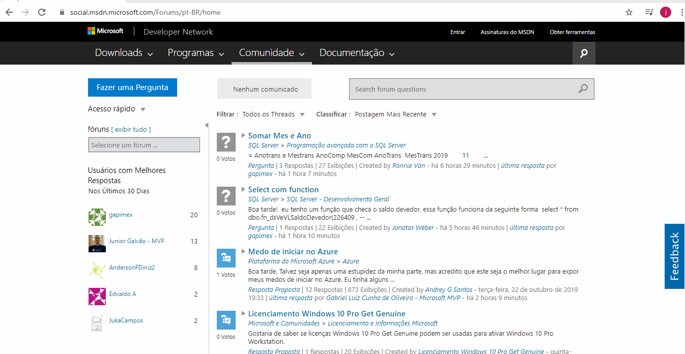
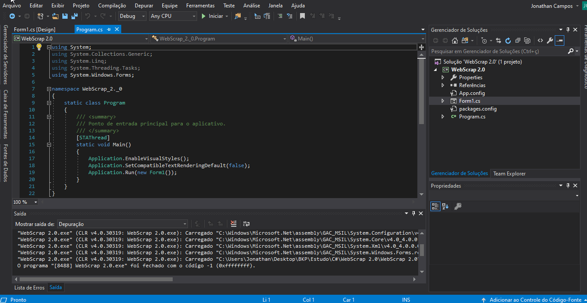

# WebScraping Forum MSDN 💻
Desenvolvimento de um WebScraping no Forum (MSDN). Fins educacionais (estudos).

## 📝 Description 

Este projeto consiste no desenvolvimento de um serviço que realiza um webscraping na pagina do MSDN. Onde filtramos
as informaçoes do primeiros topicos da pagina.

- Motivo do Desenvolvimento: Fins estudantis  
- Auxilio: Andre Secco (Youtube)

 
# Frameworks

Utilizei alguns framework´s para facilitar o desenvolvimento.

 • HtmlAgilityPack
 • .NETFramework 4.1.
 

# Execute

## Navigate to Page MSDN

  

## Execute the Code (Srapping) to  Forms

  
## 🚀 Technologies Used 

# Visual Studio 2017 - Community 
 

   

## 🔓 License 
MIT ©  Jonathan

